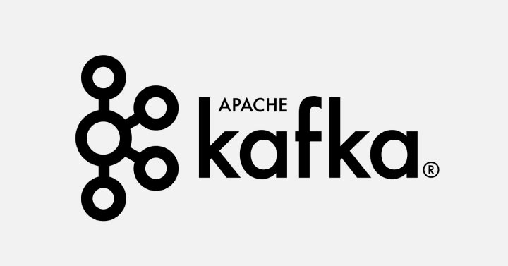

# Apache Kafka

Apache Kafka is a distributed messaging system that allows different applications to send and receive large amounts of data in real-time. It's designed to handle high volumes of data streams efficiently and reliably.

### Architecture:
Apache Kafka follows a distributed architecture, meaning it operates on a cluster of multiple servers, also known as brokers. The brokers work together to provide fault-tolerant and scalable data storage and streaming capabilities.

### Topics and Partitions:
In Kafka, data is organized into topics. A topic represents a particular category or stream of information, such as "user activity," "stock prices," or "error logs." Each topic is divided into one or more partitions, which are individual ordered sequences of records. Partitions allow Kafka to parallelize data ingestion and processing.

### Producers:
Producers are responsible for publishing data to Kafka topics. They generate data, such as log events, messages, or any other type of information, and send it to a specific topic. Producers can choose to send data to a specific partition within a topic or let Kafka automatically assign the partition.

### Consumers:
Consumers are applications or systems that subscribe to topics and retrieve data from Kafka. They consume data in real-time or at their own pace, depending on their processing requirements. Consumers can be part of a consumer group, which allows multiple instances of the same consumer application to work together to process data in parallel.

### Consumer Groups:
A consumer group is a way of scaling consumer applications in Kafka. When multiple consumers belong to the same group, Kafka automatically distributes the partitions of a topic across the consumers within the group. This parallelizes the data processing and allows each consumer to handle a subset of the partitions. Each partition is consumed by only one consumer within a consumer group at a time.

### Offsets:
Kafka maintains an ordered sequence of records within each partition and assigns a unique identifier called an offset to each record. Offsets represent the position of a record within a partition. Consumers can keep track of their progress by storing the offset of the last record they have consumed. This way, they can resume consuming from where they left off in case of failures or restarts.

### Broker Replication:
To ensure fault-tolerance and high availability, Kafka uses replication. Each partition in a topic can have multiple replicas distributed across different brokers. One replica is designated as the leader, and the others are followers. The leader replica handles all read and write requests for a partition, while the followers replicate the data for redundancy. If a leader fails, one of the followers is automatically promoted as the new leader to maintain continuity.

### Retention and Durability:
Kafka provides configurable retention policies that determine how long data is retained in a topic. Data can be retained based on time or size. Kafka can store data for a specified period or until it reaches a certain size limit. Once the retention criteria are met, older data is automatically deleted. The replication and durability mechanisms in Kafka ensure that data is not lost even if a broker fails.

### Use Cases:
Apache Kafka is commonly used for real-time data processing, streaming analytics, log aggregation, event sourcing, messaging systems, and building scalable data pipelines. It is suitable for scenarios where high throughput, low latency, fault-tolerance, and scalability are crucial, such as in financial systems, IoT applications, social media platforms, and online gaming.

In summary, Apache Kafka is a distributed messaging system that organizes data into topics and partitions, allowing for high-throughput, fault-tolerant, and scalable data streaming. Producers publish data to Kafka, consumers subscribe to topics and retrieve data in real-time, and Kafka handles the storage, replication, and distribution of data across multiple brokers.
